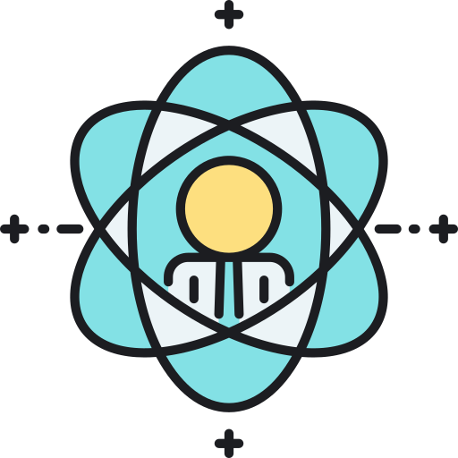
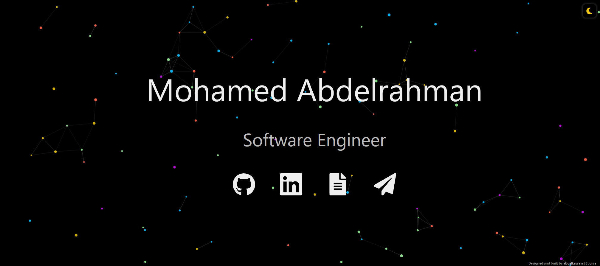
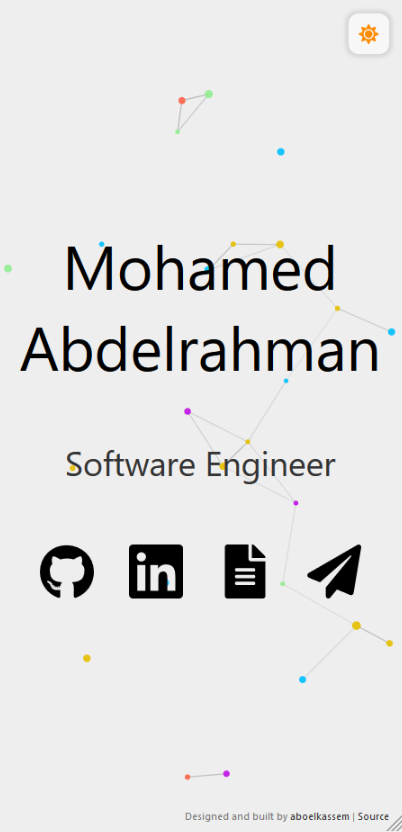

#  aboelkassem.com
The second iteration of [aboelkassem.com](https://www.aboelkassem.com) built with [React](https://reactjs.org/) and hosted with [Netlify](https://www.netlify.com/).

 

This website is designed to be simple and accessible. The dynamic particles make it both interactive and visually inviting. The website defaults to dark mode and can be toggled to light mode. Once toggled, the theme should persist between tabs, windows, and page reloads.

